# Supply chain & data auditing

This repository containts an Ethereum DApp that demonstrates a Supply Chain flow  a metal supply chain system. The user story is similar to any commonly used supply chain process. A metal producer can add items to the inventory system stored in the blockchain. A Distributor/Manufacturer can purchase such items from the inventory system. Additionally a Distributor/Manufacturer can mark an item as Shipped, and similarly a producer can mark an item as Received.

The DApp User Interface when running should look like...

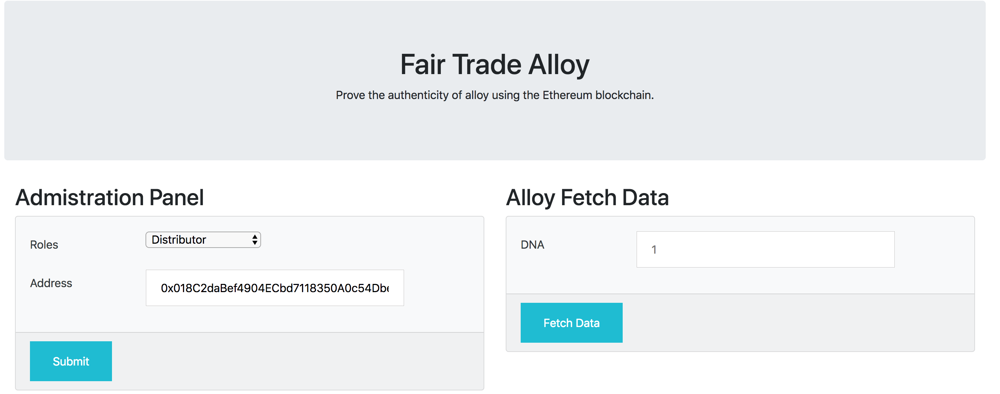

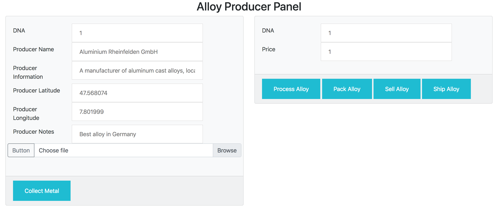

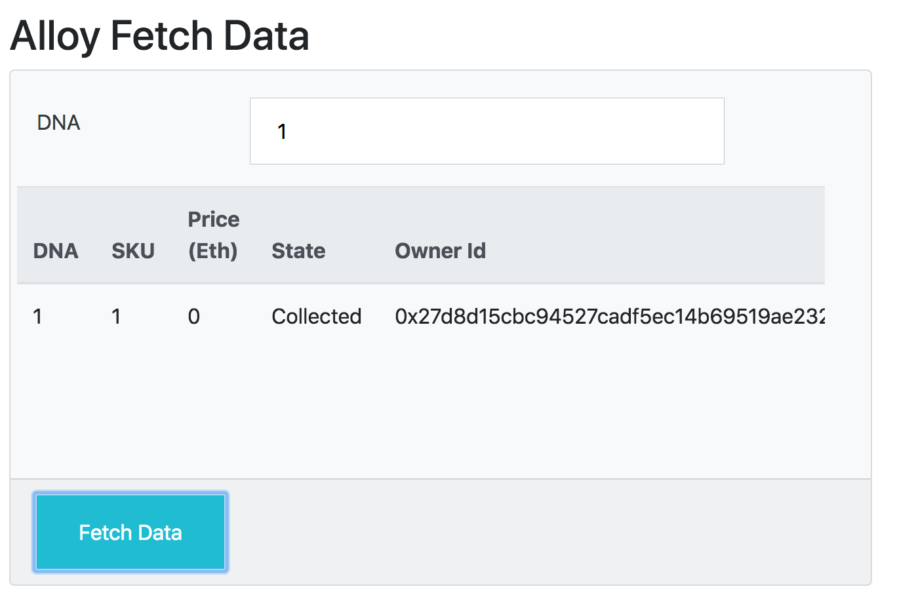

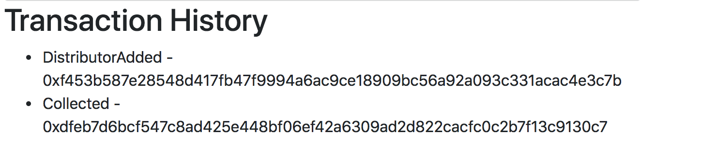


## Getting Started

These instructions will get you a copy of the project up and running on your local machine for development and testing purposes. See deployment for notes on how to deploy the project on a live system.

### Prerequisites

Please make sure you've already installed ganache-cli, Truffle and enabled MetaMask extension in your browser.

- Install ganache (graphical interface) and ganache-cli in your local environment
Donwload the installer from [https://truffleframework.com/ganache]
```
npm install -g ganache-cli
```
- Install truffle in your local environment
```
npm install -g truffle
```

### Installing

A step by step series of examples that tell you have to get a development env running

Clone this repository:

```
git clone https://github.com/JuanSenoret/smart_metal_supply_chain.git
```

Change directory to ```project-6``` folder and install all requisite npm packages (as listed in ```package.json```):

```
cd project-6
npm install
```

Launch Ganache:

```
ganache-cli -m "spirit supply whale amount human item harsh scare congress discover talent hamster"
```

Your terminal should look something like this:


In a separate terminal window in the same folder ```project-6``` copy the truffle-example.js and create a new file truffle.js. 

**(Optional if you want to deploy the contract in apublic network like Rinkeby!)** Change the constant MNEMONIC with your account menomic and change API_KEY with your infura API Key

Compile smart contracts:

```
truffle compile
```

Your terminal should look something like this:

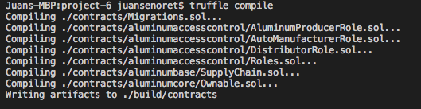

This will create the smart contract artifacts in folder ```build\contracts```.

Migrate smart contracts to the locally running blockchain, ganache-cli:

```
truffle migrate --network development
```

Your terminal should look something like this:


Test smart contracts:

```
truffle test test/TestSupplyChain.js
```

All 23 tests should pass.

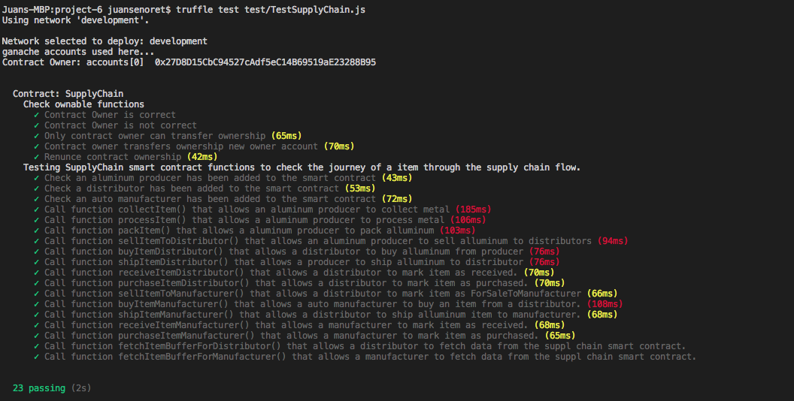

In a separate terminal window, launch the DApp:

```
npm run dev
```

Configure Metamask to connect to your local ganache network where the contract has been deployed:

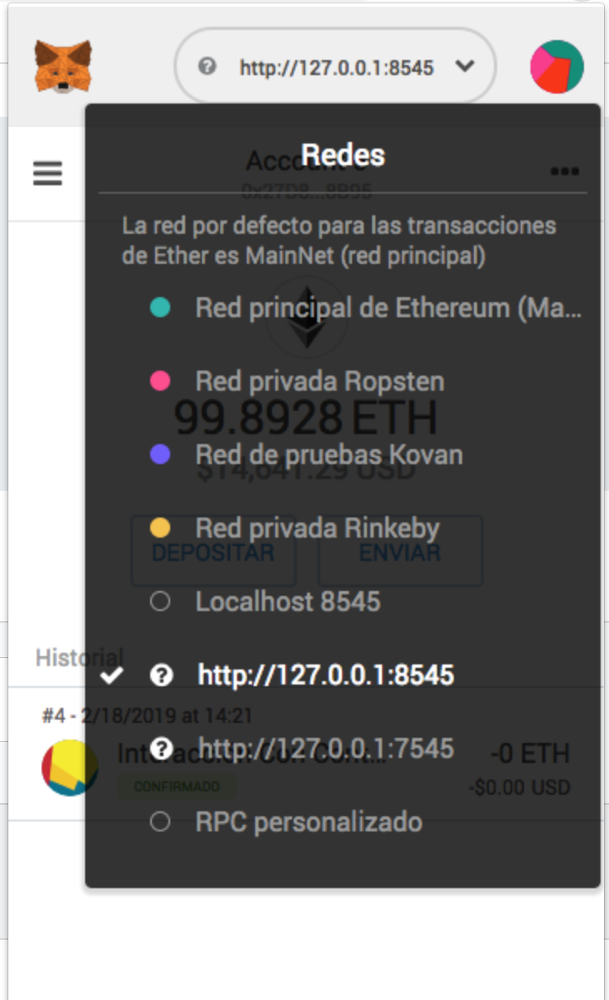

Import at least three accounts from your ganache network to Metamask (a producer role, a distributor role, a manufacturer role). You can copy the private key fro the console after call ganache-cli and used to import the account to Metamask:

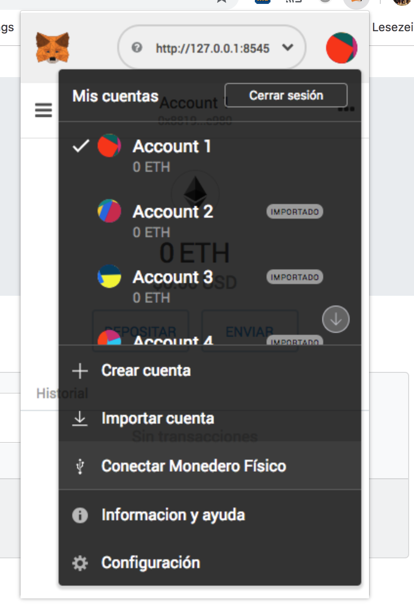

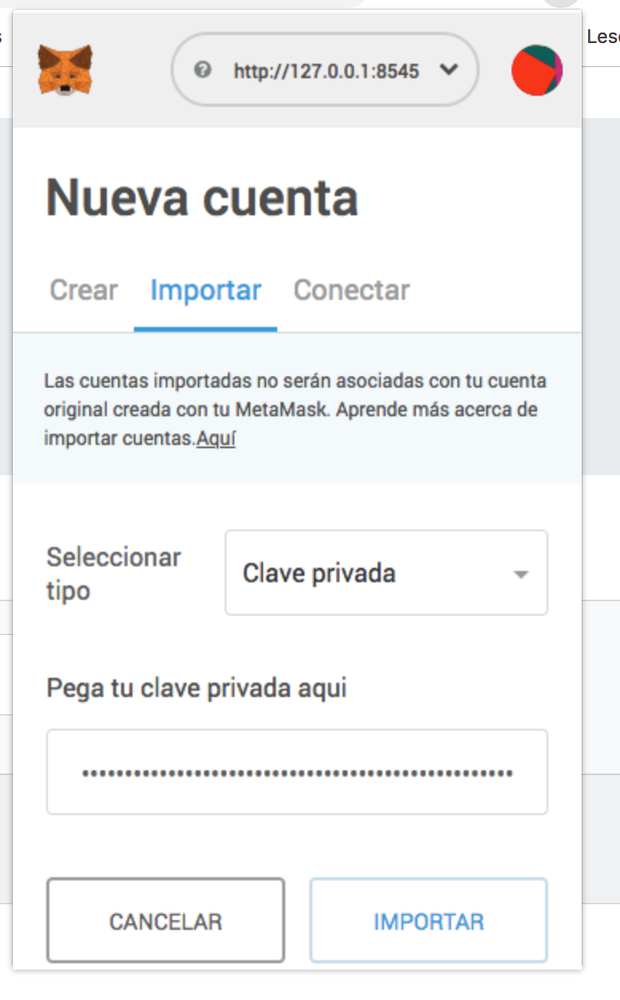

Using the "Administration Panel" in the web app and from the owner account (first account in the ganache account list), you can add accounts for the differents roles in the supply chain smart contract


Using the in metamask the producer account you can add new item in the supply chain smart contract. Acctions be performed by alloy producer:
* Collect metal (when the item is created in the smart contract)
* Mark alloy item as processed
* Sell alloy item to auto distributor
* Ship alloy item to auto distributor


Using the in metamask the distributor account you can 
* Buy alloy from producer
* Mark alloy item as received
* Mark alloy item as purchased
* Sell alloy item to auto manufacturer
* Ship alloy item to auto manufacturer

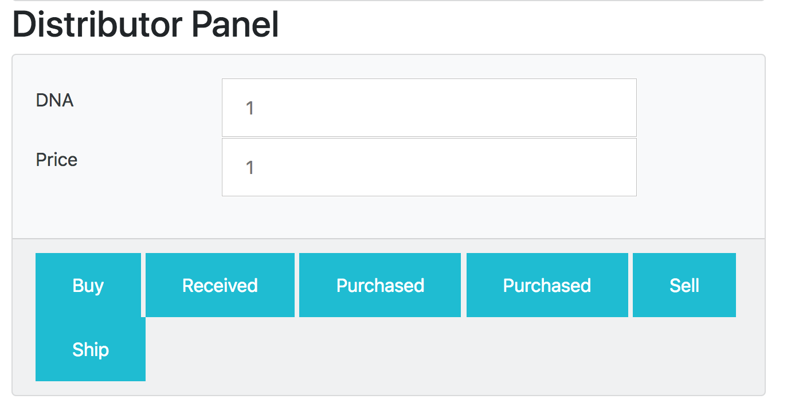

Using the in metamask the distributor account you can 
* Buy alloy from distributor
* Mark alloy item as received
* Mark alloy item as purchased

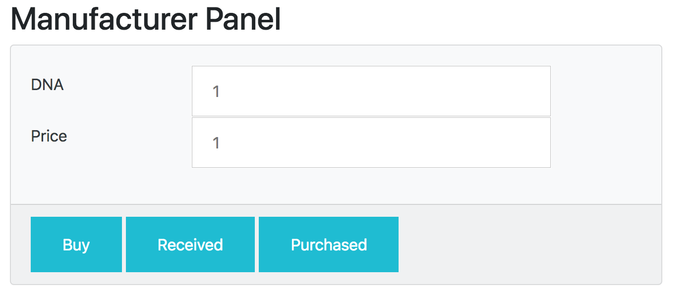

To check the process and the states of the item please check the state diagram under "architecture_uml_diagrams" folder

## Built With

* [Ethereum](https://www.ethereum.org/) - Ethereum is a decentralized platform that runs smart contracts
* [Truffle Framework](http://truffleframework.com/) - Truffle is the most popular development framework for Ethereum with a mission to make your life a whole lot easier.

## Acknowledgments

* Solidity
* Ganache-cli
* Truffle
